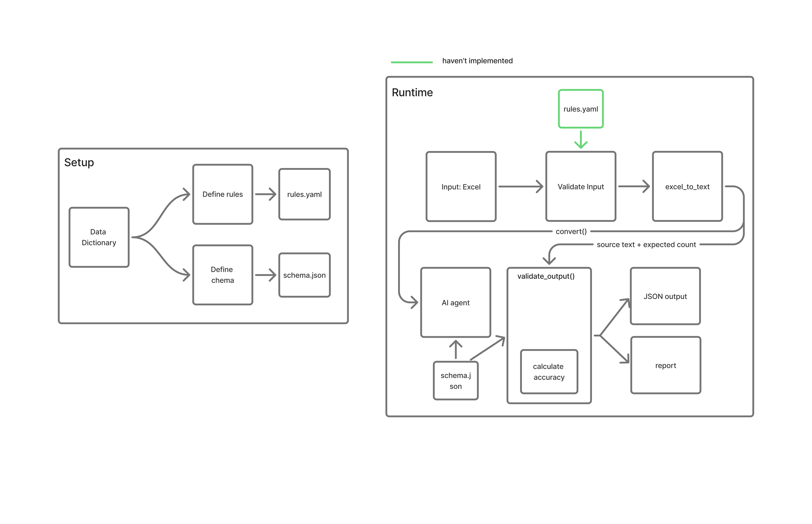

# Datadictionary-to-json
Converts data dictionaries into structured JSON
using an AI agent constrained by a predefined JSON Schema.
## Implemented so far

**Core pipeline**: runs end to end on a synthetic sample file:

- `read_excel_df()`: reads one sheet (default `"Mapping"`) as a raw,
  header-less grid and drops fully empty rows, so records with missing
  values survive intact.
- `df_to_text()`: turns that grid into plain CSV text for the agent.
  (These two together replace the old `excel_to_text()`; the split lets
  `main()` validate and count rows on the DataFrame before it becomes text.)
- `convert()`: sends the text plus `schema.json` to Gemini
  (`gemini-3.5-flash`). The prompt explains the lineage layout and its
  conventions: one record per data row, stages in pipeline order, absent
  stages omitted (not null-padded), null only for unknown values within a
  present stage. The agent restructures only: never invents values,
  never adds, drops, or merges records.
- `schema.json`: the output contract, now lineage-based. Each record is
  one field's journey through the platform:
  `{ description, lineage: [ { stage, table, column, doc_link, offline_path } ] }`
  with `stage` an enum of `source_onprem | staging | dwh | cloud` and
  `additionalProperties: false`.

**Validation checkpoints** (both collect *all* problems into a list
instead of raising on the first one):

- `validate_input(df)` — checkpoint 1, runs **before** the API call so a
  bad file fails fast and free. Layout-generic only: the sheet has data
  rows after dropping empty ones, and has at least 3 columns.
- `validate_output(result, expected_count, schema, source_text)` —
  checkpoint 2, runs **after** the call. Three independent checks:
  - **shape** — full `jsonschema` validation against `schema.json`,
    reporting every violation with its JSON path;
  - **completeness** — record count must equal the number of input data
    rows (both numbers reported on mismatch), mechanically enforcing the
    "never add/drop/merge records" rule;
  - **fidelity** — every `table`/`column` value in the output must exist
    verbatim in the source text, mechanically enforcing the
    "never invent values" rule.

**`main()` flow**: read sheet → `validate_input` (print all errors and
exit 1 on failure) → compute `expected_count` (rows minus the 3 header
rows: environment, stage, column names) → `df_to_text` → `convert` →
`validate_output` (print all errors and exit 1 on failure) → write
`output.json` and print the record count.

Verified on the sample lineage mapping: 5/5 records converted with
lineage lengths 4/4/3/4/2 as expected, absent stages omitted, the
mid-chain rename (`REL_DT` → `RELEASE_DATE_KEY` at DWH) captured, and
missing values preserved as null.
## Architecture 
